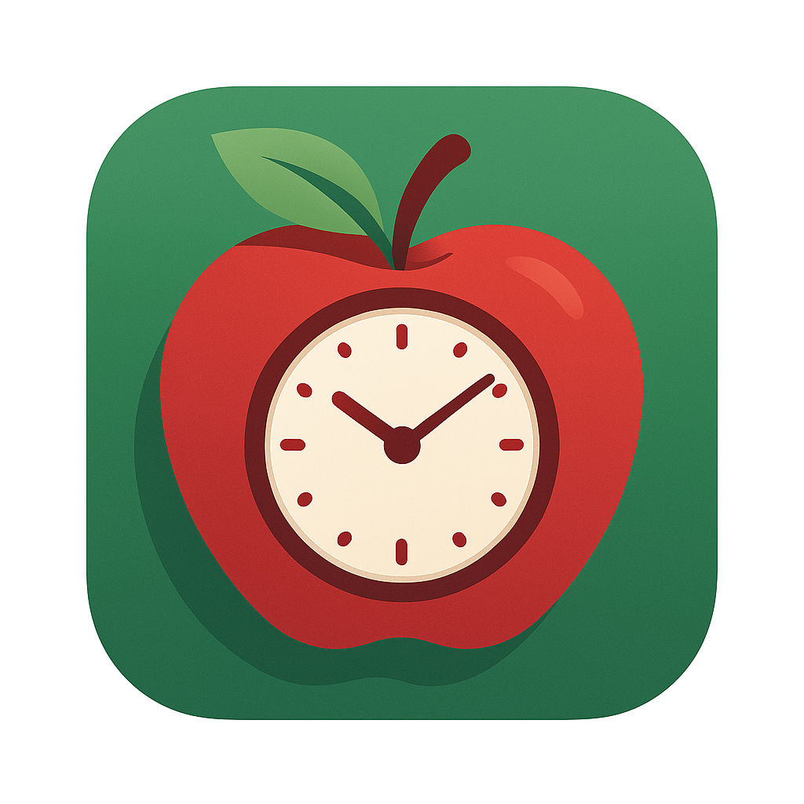

<div align="center">
    
    <h1>MindYourShelf</h1>
</div>

MindYourShelf is a Flutter-based mobile app designed to help users manage their food inventory, track expiration dates, donate surplus food to local communities, and reduce food waste. It provides an intuitive user interface for users to view food expiry dates, track donations, and receive push notifications when items are about to expire.

## ✨ Features

- **Track Food Expiry Dates:** Keep track of the expiry dates of food items and receive notifications before they expire
- **Donate Surplus Food:** Easily donate surplus food to people in your local area
- **Recipe Suggestions:** Discover recipes tailored to the ingredients you already have at home
- **Push Notifications:** Get notified when items are about to expire
- **Monthly Food Stats:** Monitor food waste reduction progress through visual statistics and actionable insights

## 📱 Download on Google Play Store

<a href="https://play.google.com/store/apps/details?id=com.shelfaware.shelfaware_app&pcampaignid=web_share">
  
</a>

## 🔧 Tech Stack

- **Flutter:** Cross-platform mobile app development
- **Firebase:** Real-time database and push notifications
- **Google Maps API:** Maps and donation markers
- **Mapbox API:** Address search and geocoding
- **Spoonacular API:** Recipe retrieval and cooking instructions
- **Open Food Facts API:** Barcode-based food details

## 💻 Installation

### Prerequisites

- [Flutter SDK](https://flutter.dev/docs/get-started/install)
- [Dart SDK](https://dart.dev/get-dart)
- [Firebase CLI](https://firebase.google.com/docs/cli#install_the_firebase_cli)
- Code editor (VS Code recommended)

### Firebase Setup

1. Create a project at [Firebase Console](https://console.firebase.google.com/)
2. Enable Authentication, Firestore, and Storage
3. Install Firebase CLI and login:
```bash
npm install -g firebase-tools
firebase login
```
4. Initialise Firebase:
```bash
firebase init
```
5. Add `google-services.json` to `android/app/`
6. Add `GoogleService-Info.plist` to iOS

### Getting Started

1. Clone the repository:
```bash
git clone https://github.com/40125789/shelfaware_app.git
cd shelfaware_app
```

2. Install dependencies:
```bash
flutter pub get
```

3. Run the app:
```bash
flutter run
```

## 📖 Documentation

For detailed instructions on how to use MindYourShelf, please refer to the [User Manual](docs/MindYourShelf_user_manual.pdf).

For a detailed report on tester feedback, including observations, issues, and suggested improvements, please refer to the [Testers Feedback Report](docs/com.shelfaware.shelfaware_app_feedback.pdf).


## 🔑 Environment Setup

Create `.env` in root directory:
```bash
SPOONACULAR_API_KEY=your_api_key_here
GOOGLE_MAPS_API_KEY=your_other_api_key_here
MAPBOX_ACCESS_TOKEN=your_access_token_here
```

> **Note:** Do not commit your .env file. Add it to .gitignore.

## 🤝 Contributing

We welcome contributions! You can:
- Report bugs
- Suggest features
- Write tests
- Fix issues
- Improve documentation

## 📦 Dependencies

### Firebase
- firebase_core
- firebase_auth
- cloud_firestore
- firebase_storage
- firebase_messaging
- cloud_functions
- firebase_app_check

### UI Components
- flutter_slidable
- flutter_swipe_action_cell
- lottie
- google_nav_bar
- flutter_launcher_icons
- curved_navigation_bar

### Maps & Location
- google_maps_flutter
- geolocator
- location
- geocoding

### Utilities
- flutter_dotenv
- provider
- Riverpod
- barcode_scan2
- camera
- google_ml_kit

## 👏 Acknowledgements

Special thanks to my supervisor Leo Galway for his help and guidance throughout this project.


## 📄 License

[](LICENSE)

This project is licensed under the MIT License – see the [LICENSE](LICENSE) file for details.

